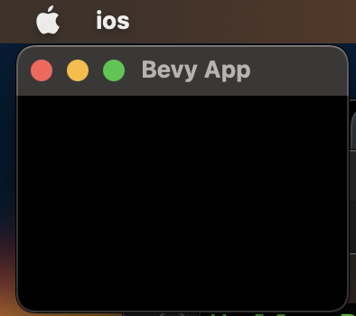

# Fanorona


- [ ] Add the `bevy` library

```
cargo add bevy
```

- [ ] Replace `src/main.rs` source code with the below snippet

```rust
use bevy::prelude::*;

fn main() {
    App::new()
        .add_system(hello_world_system)
        .run();
}

fn hello_world_system() {
    println!("Hello Rust");
}
```

- [ ] Test

```
cargo run
```
> Outputs :
<pre>
   Compiling ios v0.1.0 (~/Developer/fanorona-bevy/docs/init/ios)
    Finished dev [unoptimized + debuginfo] target(s) in 1.54s
     Running `target/debug/ios`
Hello Rust
</pre>

:round_pushpin: Where is the GUI?

- [ ] Add the `Bevy`'s default plugins to the `App`

```rust
  .add_plugins(DefaultPlugins)
```

- [ ] Test

```
cargo run
```
> Outputs :
<pre>
   .....
   Compiling ios v0.1.0 (/Users/<redacted>/Developer/fanorona-bevy/docs/init/ios)
    Finished dev [unoptimized + debuginfo] target(s) in 3m 10s
     Running `target/debug/ios`
2023-04-02T20:59:22.061203Z  INFO bevy_render::renderer: AdapterInfo { name: "Apple M1", vendor: 0, device: 0, device_type: IntegratedGpu, driver: "", driver_info: "", backend: Metal }
2023-04-02T20:59:22.574230Z  INFO bevy_winit::system: Creating new window "Bevy App" (0v0)
2023-04-02T20:59:22.674665Z  INFO bevy_diagnostic::system_information_diagnostics_plugin::internal: SystemInfo { os: "MacOS 13.2.1 ", kernel: "22.3.0", cpu: "Apple M1", core_count: "8", memory: "16.0 GiB" }
Hello Rust
Hello Rust
Hello Rust
</pre>



:two: Building for iOS (Cross Platform Upfront)

- [ ] Bundling (if not already installed)

```
cargo install cargo-bundle
```
> Outputs :
<pre>
    Updating crates.io index
  Downloaded cargo-bundle v0.6.0
  ...
  Downloaded 63 crates (2.1 MB) in 0.52s
   Compiling autocfg v1.1.0
   ...
   Compiling strsim v0.7.0
   Compiling cargo-bundle v0.6.0
    Finished release [optimized] target(s) in 29.11s
  Installing /Users/[redacted]/.cargo/bin/cargo-bundle
   Installed package `cargo-bundle v0.6.0` (executable `cargo-bundle`)
</pre>

- [ ] Adding Compilation Targets

```
rustup target list | grep ios
```
> Outputs :
<pre>
aarch64-apple-ios (installed)
aarch64-apple-ios-sim (installed)
x86_64-apple-ios (installed)
</pre>


```shell
# for production
rustup target add aarch64-apple-ios
```
> info: component 'rust-std' for target 'aarch64-apple-ios' is up to date

```shell
# for development
rustup target add aarch64-apple-ios-sim
```
> info: component 'rust-std' for target 'aarch64-apple-ios-sim' is up to date

```
cargo bundle --target aarch64-apple-ios-sim
```
> Outputs :
<pre>
   Compiling cfg-if v1.0.0
   Compiling libc v0.2.140
   ...
   Compiling ios v0.1.0 (/Users/[redacted]/Developer/fanorona-bevy/docs/init/ios)
    Finished dev [unoptimized + debuginfo] target(s) in 40.18s
warning: iOS bundle support is still experimental.
    Bundling ios.app
    Finished 1 bundle at:
        /Users/[redacted]/Developer/fanorona-bevy/docs/init/ios/target/aarch64-apple-ios-sim/debug/bundle/ios/ios.app
</pre>


```
ls -l target | grep aarch64
```
> drwxr-xr-x@  4 redacted  staff  128  2 Apr 17:06 aarch64-apple-ios-sim


- [ ] Install [`Dasel`](https://daseldocs.tomwright.me/)

```
brew install dasel
```

- [ ] Launch the App

```
bash launch-simulator.sh                   
```
> Outputs :
<pre>
warning: crate `Fanorona` should have a snake case name
  |
  = help: convert the identifier to snake case: `fanorona`
  = note: `#[warn(non_snake_case)]` on by default

warning: `Fanorona` (bin "Fanorona") generated 1 warning
    Finished dev [unoptimized + debuginfo] target(s) in 0.13s
warning: iOS bundle support is still experimental.
    Bundling Fanorona.app
    Finished 1 bundle at:
        /Users/u0000000021/Developer/fanorona-bevy/docs/init/ios/target/aarch64-apple-ios-sim/debug/bundle/ios/Fanorona.app
An error was encountered processing the command (domain=com.apple.CoreSimulator.SimError, code=405):
Unable to boot device in current state: Booted
com.valiha.fanorona: 42705
2023-04-02T21:20:02.258300Z  INFO bevy_render::renderer: AdapterInfo { name: "Apple iOS simulator GPU", vendor: 0, device: 0, device_type: DiscreteGpu, driver: "", driver_info: "", backend: Metal }
2023-04-02T21:20:02.839413Z ERROR bevy_gilrs: Failed to start Gilrs. Gilrs does not support current platform.
2023-04-02T21:20:02.858829Z  INFO bevy_winit::system: Creating new window "Bevy App" (0v0)
2023-04-02T21:20:02.858896Z  WARN winit::platform_impl::platform::window: `WindowAttributes::min_inner_size` is ignored on iOS    
Hello Rust
2023-04-02T21:20:02.953223Z  WARN winit::platform_impl::platform::app_state: processing non `RedrawRequested` event after the main event loop: RedrawEventsCleared    
2023-04-02T21:20:02.953535Z  WARN winit::platform_impl::platform::app_state: processing non `RedrawRequested` event after the main event loop: WindowEvent {
    window_id: WindowId(
        WindowId {
            window: 0x000000012c41e900,
        },
    ),
    event: Resized(
        PhysicalSize {
            width: 3840,
            height: 2160,
        },
    ),
}    
2023-04-02T21:20:02.953750Z  WARN winit::platform_impl::platform::app_state: processing non `RedrawRequested` event after the main event loop: RedrawEventsCleared    
Hello Rust
2023-04-02T21:20:02.985436Z  WARN winit::platform_impl::platform::app_state: processing non `RedrawRequested` event after the main event loop: RedrawEventsCleared    
2023-04-02T21:20:02.985518Z  WARN winit::platform_impl::platform::app_state: processing non `RedrawRequested` event after the main event loop: WindowEvent {
    window_id: WindowId(
        WindowId {
            window: 0x000000012c41e900,
        },
    ),
    event: Resized(
        PhysicalSize {
            width: 3840,
            height: 2160,
        },
    ),
}    
Hello Rust
2023-04-02T21:20:03.007684Z  WARN winit::platform_impl::platform::app_state: processing non `RedrawRequested` event after the main event loop: RedrawEventsCleared    
Hello Rust
2023-04-02T21:20:03.014765Z  WARN winit::platform_impl::platform::app_state: processing non `RedrawRequested` event after the main event loop: RedrawEventsCleared    
Hello Rust
</pre>

- [ ] App

The app will display nothing but the Terminal output is shown above.

After exiting (pressing home button) you will see the App Icon on the Home Page

 </img>


:x: Troubleshooting

- [ ] Add `.package.description` field to `Cargo.toml` file

```
cargo bundle --target aarch64-apple-ios-sim
```
> error: missing field `description` for key `package`


# References

- [ ] [Native iOS Game Development w/ Rust](https://dev.to/wadecodez/exploring-rust-for-native-ios-game-development-2bna)
- [ ] [aarch64-apple-ios-sim](https://doc.rust-lang.org/rustc/platform-support/aarch64-apple-ios-sim.html)

